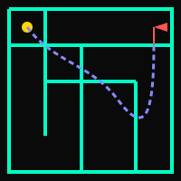

# Maze and Cave Generator and Solver



## 📘 Описание проекта/Project Description

Проект представляет собой Qt-приложение для генерации и визуализации лабиринтов и пещер с возможностью нахождения кратчайшего пути. Включает серверную часть для удаленного управления. / Qt application for maze and cave generation with pathfinding capabilities. Includes server component for remote control.

---

## 🔧 Особенности / Features

### Основные компоненты / Core Components

- Графический интерфейс (Qt 6) / GUI (Qt 6)
- Серверная часть (TCP) / Server component (TCP)
- Алгоритмы генерации / Generation algorithms
  - Лабиринты (алгоритм Эллера) / Mazes (Eller's algorithm)
  - Пещеры (клеточные автоматы) / Caves (cellular automata)

- Алгоритмы поиска пути / Pathfinding algorithms
  - BFS
  - Q-learning (с обучением) / Q-learning (with training)

### Технические характеристики / Technical Specs

- Сборка через make / Build with make
- Поддержка C++20 / C++20 support
- Модульные тесты / Unit tests
- Проверка стиля кода / Code style checks


## 📁 Структура проекта / Project Structure

```text
src/
├── model/
│   ├── maze/         # Логика лабиринтов и пещер / 
│   │                 # Maze logic, generation and solving algorithms
│   └── q_learning/   # Алгоритм Q-learning / Q-Learning algorithms
├── server/           # TCP сервер / TCP Server
├── ui/               # Графический интерфейс
│   ├── widgets/      # Кастомные виджеты / GUI
│   └── *.h           # Основные классы интерфейса / Main classes
├── tests/            # Тесты / Unit tests
└── Makefile          # Система сборки Build and project management

```

## ▶️ Installation and Launch

- ### 🧱 Dependencies

  Qt 6 (Core, Widgets, Gui, Network)\
  Компилятор с поддержкой C++20 / C++20 compatible compiler\
  (Опционально / Optional) valgrind, gcov, cppcheck


- ### 🛠️ Сборка / Build


```bash
make
```

- ### 🚀 Запуск / Run

#### 🖥️ Графический интерфейс / GUI

```bash
./maze
```

#### 🌐 Серверная часть (в отдельном терминале) / Server (in separate terminal)

```bash
./srv
```
  После запуска сервера откройте в браузере адрес:
  http://localhost:8080\
  After starting the server, open the following address in your browser: 
  http://localhost:8080

## 📜 Примеры использования / Usage Examples

### Основные команды сборки / Build Commands


| Команда / Command	| Назначение / Purpose |
|:------------------|:---------------------|
|`make`	| Сборка проекта / Build project|
|`make clean`|	Очистка сборки / Clean build|
|`make cl`|	Проверка стиля кода / Code style check|
|`make tests`| Запуск тестов / Run tests|
|`make valgrind`|	Проверка утечек памяти / Memory leak check|
|`make cppcheck_cpp`|	Статический анализ кода / Static code analysis|
|`make gcov_report`| Генерация отчета покрытия / Coverage report|
|`make dist`|	Создание дистрибутива / Create distribution package|
|`make dvi`|	Генерация документации html / Generate documentation|
|`make pdf`|  Генерация документации pdf / Generate documentation|


### 📄 File Format

Files must contain:

First line — size (rows and columns)\
Then — vertical wall matrix\
For mazes — horizontal wall matrix

Example:

```
3 3
0 1 0
1 0 1
0 1 0

1 0 1
0 1 0
1 0 1
```


## 🧰 Requirements

### Основные / Core

- Qt 6 (Core, Widgets, Gui, Network)\
- C++20 компилятор / C++20 compiler\
- GNU Make

### Для разработки / For Development

- clang-format (для проверки стиля / for code style)\
- cppcheck (для статического анализа / for static analysis)\
- valgrind (для проверки памяти / for memory checking)\
- gcov/lcov (для покрытия кода / for code coverage)\
- doxygen (для документации / for documentation)

## 📦 Создание дистрибутива / Creating Distribution

```bash
make dist #maze_cpp_src.tar.gz
```

Архив содержит весь исходный код проекта, готовый для распространения. / The archive contains all project source code ready for distribution.


## ⚙️ Установка и удаление / Installation and Uninstallation

### Установка / Install

Для установки собранных бинарников выполните:\
To install the built binaries, run:

```
make install
```
По умолчанию файлы будут установлены в папку bin в корне проекта.\
By default, the files will be installed to the bin directory in the project root.

Вы можете изменить папку установки, указав переменную BINDIR, например:\
You can change the installation directory by specifying the BINDIR variable, for example:
```
make install BINDIR=/usr/local/bin
```

### Удаление / Uninstall

Для удаления установленных файлов выполните:\
To remove the installed files, run:
```
make uninstall
```
Эта команда удалит бинарники из папки установки и, если папка будет пустой, удалит её.\
This command removes the binaries from the installation directory and deletes the directory if it becomes empty.


